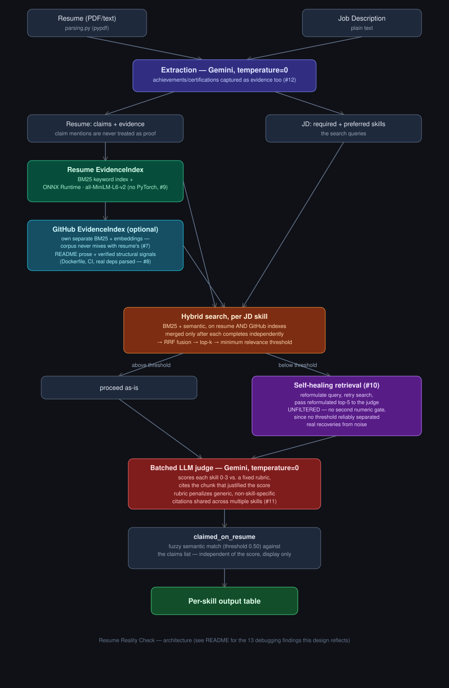

# Resume Reality Check

**A resume–job description evidence verifier: it doesn't just check if you claimed a skill — it checks whether you can actually prove it.**

Most resume-matching tools compare keywords. This one separates what a candidate *claims* from what their actual experience *demonstrates*, using hybrid retrieval (keyword + semantic search) and an LLM-as-judge scored against a fixed rubric — then validates its own accuracy against a hand-labeled evaluation set.

On my own resume, this system found that I claimed "Python" in my skills section, but **zero** of my evidence bullets described using it — because the language was only ever named in a project's tech-stack tag line, never in the bullet text itself. That single finding kicked off thirteen real debugging investigations, documented below — spanning retrieval precision, LLM infrastructure quirks, production deployment, and generalization across three different resumes.

**Live demo:** [resume-reality-check-production.up.railway.app/docs](https://resume-reality-check-production.up.railway.app/docs) — first response can take up to ~2 minutes (multiple sequential LLM calls; see finding #9 for why this is deployed on Railway rather than Render).

---

## What it does

1. Upload a resume + a job description
2. The system splits the resume into **claims** (bare skill mentions, e.g. a skills list) and **evidence** (actual experience/project bullets) — a claim alone is never treated as proof
3. For each skill the job description requires, it searches the evidence using **hybrid retrieval**: BM25 (keyword) + sentence-embedding similarity (semantic), fused with Reciprocal Rank Fusion
4. An LLM judge scores the retrieved evidence 0–3 against a fixed rubric, citing the exact bullet that justified the score
5. Output: a per-skill table — skill, claimed-on-resume (yes/no), evidence score, and the cited proof

## Why this is different from a keyword matcher

A keyword matcher checks: *does the word "Kubernetes" appear on this resume?*
This checks: *is there a bullet point that actually describes using Kubernetes — and if the resume says "container orchestration" instead, can the system still find that connection?*

The claims-vs-evidence separation is enforced architecturally: the retrieval index is built **only** from evidence bullets. The claims list is never searched — it exists solely as a side-by-side comparison, so the output can say "claimed: yes, evidence: none" as a distinct, meaningful signal.

---

## Architecture



**Tech stack:** FastAPI · Gemini (gemini-3.6-flash) · ONNX Runtime + all-MiniLM-L6-v2 (local embeddings, no PyTorch) · rank-bm25 (BM25) · Reciprocal Rank Fusion · self-healing/query-reformulation retrieval · GitHub REST API (structural + prose evidence) · Pydantic structured outputs · Docker · deployed on Railway

---

## What's built and validated (today's work)

### Core pipeline
- PDF/text parsing
- Claims vs. evidence extraction with structured output (Pydantic schemas)
- Hybrid retrieval: BM25 + semantic search, fused with RRF (k=60)
- Batched LLM-as-judge scoring (all skills in one call, to respect API rate limits)
- Per-skill output table with cited evidence

### Evaluation methodology
- 12 hand-labeled skill/evidence pairs (`eval/labeled_pairs.json`) — my own judgment, recorded independently, used as ground truth
- `eval/run_eval.py` — automatically compares fresh pipeline output against these labels, reports agreement %
- This is a fixed, read-only reference file; the eval script never modifies it. It's the "answer key" I check new code changes against.

### Thirteen real bugs found and fixed, in order

**1. Evidence bullets didn't inherit their project's tech-stack context**
Resume bullets like *"Developed the retrieval flow using CLIP embeddings and Qdrant vector search"* never literally say "Python" — even though the project header explicitly tags it. Before the fix, "Python" scored 0/3 despite being used in every project on the resume.
**Fix:** Prepend each project's tech-stack tags to its evidence bullets during extraction (`[Technologies used: Python, GPT-4o, CLIP, Qdrant, AWS S3] Developed the retrieval flow...`).
**Result:** Python correctly scores 2/3, citing real project work.

**2. Retrieval always returns its "best available" chunks, even when nothing is genuinely relevant (low precision)**
Skills like "Data structures and algorithms" and "MLOps" scored false positives — the system cited a semantically-adjacent-but-irrelevant bullet (e.g. justifying "MLOps" from a bullet about weekly performance reporting) rather than reporting no real evidence.
**Fix:** Added a minimum relevance threshold to the hybrid search — if even the top-ranked chunk doesn't clear the bar, the skill is scored 0 locally instead of being forced through the judge.
**Result:** Score agreement with my hand-labeled set improved from ~77% to 90% on the labeled cases.
**Concept:** this is a deliberate precision-over-recall tradeoff — in this domain, a false positive (falsely claiming evidence exists) is more costly than a false negative (being conservative), because it actively misleads the person relying on the tool.

**3. Claims-matching used exact string comparison, missing legitimate matches**
`claimed_on_resume` showed "No" for skills the resume clearly claims — e.g., the JD says "RAG" but the resume says "Retrieval Augmented Generation (RAG)"; JD says "Cloud platforms," resume says "AWS/Azure." Exact-string `in` checks can't see these are the same thing.
**Fix:** Replaced exact matching with semantic similarity (the same embedding model already used for retrieval) between each JD skill and each resume claim.

**4. The first fuzzy-matching threshold (0.60) couldn't cleanly separate correct from incorrect matches**
Diagnostic scoring showed false positives and true positives *interleaved* on the score axis — no single threshold value could separate them. Investigating further revealed two of the "false positives" were actually mislabeled in my own initial ground truth: "Practical AI application" ↔ "Artificial Intelligence (AI)" and "Business process automation" ↔ "Intelligent Automation" are reasonably close matches, not false positives. Once corrected, a threshold of **0.50** cleanly separates all 8 labeled cases.
**Lesson:** the eval set caught an error in my own judgment, not just the system's — exactly what a proper evaluation process is supposed to do.

**5. Eval results were unstable run-to-run, traced to LLM temperature**
Re-running the eval script with zero code changes produced different numbers each time — job-skill extraction would sometimes split "Data structures and algorithms" into "Data Structures" alone, or "Communication, documentation, and collaboration" into just "Documentation," changing which fuzzy matches succeeded.
**Fix:** Set `temperature=0` on all extraction and judge LLM calls, so the same input reliably produces the same output.
**Why it matters beyond testing:** this affects the real product too — without it, a recruiter running the same resume twice could get different results between runs.

**6. `temperature=0` reduced but did not eliminate non-determinism — traced to a deeper, unfixable infrastructure cause**
Even with `temperature=0` on all three LLM calls, two consecutive eval runs still disagreed on 4 of 11 skills — one run's extracted skill set included "MLOps" but not "RAG"; the other included "RAG" but not "MLOps." Investigating further: this is a known, documented characteristic of hosted LLM APIs, not a bug in this codebase. Providers batch multiple users' requests together on shared infrastructure for efficiency; combined with Mixture-of-Experts routing (where only a subset of a model's specialized sub-networks handle any given request) and floating-point non-associativity (the order in which a computer sums numbers can produce tiny rounding differences), the *exact* probability distribution the model computes can vary slightly between otherwise-identical requests — occasionally enough to flip which token or expert is "most likely," even though `temperature=0` deterministically always selects the top-ranked option. This happens upstream of the model's own reasoning, at the routing/serving layer.
**Mitigation:** Since this can't be fully eliminated, I isolated it instead — cached the job-description skill extraction (the step most affected, since skill-boundary decisions often sit at genuine ambiguity thresholds) to a file after the first run, so subsequent eval runs compare against a fixed, stable reference rather than a fresh, potentially-different extraction each time. The resume-side extraction still calls the API fresh each run; this is a known, accepted remaining source of minor variation, not yet mitigated.
**Why this finding matters:** it's a real limit of building on hosted LLM infrastructure, not something more careful prompting or code can fully solve — the honest fix is to isolate and stabilize what you can (the eval process), rather than pursue perfect reproducibility that hosted APIs don't currently offer.

**7. Merging GitHub evidence into the resume's search index silently broke unrelated resume-only scores (BM25 corpus pollution)**
After adding GitHub evidence, five skills that previously had correct, well-evidenced resume-only scores (e.g. "Collaboration," "Cloud platforms") dropped to 0 with no cited evidence — even though nothing about the resume itself changed. Root cause: BM25's term weighting is computed relative to the *entire* corpus it's searching. Merging 3-4 GitHub chunks into the same pool as the 13 resume chunks shifted the corpus-wide word-rarity statistics for every query, including ones that had nothing to do with GitHub — pushing some previously-fine resume scores just below the relevance threshold from finding #2.
**Fix:** Build two fully separate `EvidenceIndex` objects — one for resume evidence, one for GitHub evidence — each with its own independent BM25 corpus. Search each independently, then merge only the already-ranked *results* afterward, never the raw chunks. This guarantees, by construction, that one source's statistics can never influence the other's scoring.
**Verified:** for all 18 job skills, resume-only retrieval now returns byte-identical results whether or not GitHub evidence is present alongside it — checked structurally, not just observed once.

**8. A generic "requirements.txt exists" signal was treated as strong evidence for unrelated skills**
The structural-signal rubric rule (any structural signal + descriptive prose → score 3) didn't check whether the signal was topically relevant to the specific skill being scored. Since `requirements.txt` exists in nearly every Python repo, it was inflating scores for "Documentation" and "API-based integrations" — skills that have nothing to do with having a dependency file.
**Fix:** Instead of a boolean "does requirements.txt exist" check, parse its actual contents and surface the specific package names found (e.g. "Verified dependencies: fastapi, sentence-transformers"). The rubric now only credits a *specific matching package name* as strong evidence (e.g. `fastapi` → "REST APIs"), not the file's mere existence. This is also a better signal in principle: dependency files are typically auto-generated (`pip freeze`), making the package list itself harder to fake than prose.
**Result:** previously-inflated scores dropped to correct levels with no file-existence claim; genuine matches (e.g. Python confirmed via `fastapi`/`pydantic` in a real requirements.txt) kept their score, now for the right, specific reason.

**9. Free-tier hosting killed long-running requests mid-flight — root-caused across four ruled-out theories before finding the real one**
Deployed to Render's free tier; `/analyze` calls (which make several sequential Gemini calls, 65-115s total) intermittently returned 502s. Investigated four hypotheses in order, each with real measurements, not guesses:
- *Memory (OOM)* — genuinely was the cause initially (idle memory sat at 507/512MB, 99%, just from importing PyTorch + sentence-transformers). **Fixed** by replacing the sentence-transformers/PyTorch embedding stack with ONNX Runtime running the same model (`all-MiniLM-L6-v2`) — same weights, same architecture, lighter execution engine. Verified retrieval rankings were unaffected (identical top-5 order and RRF scores to 4 decimal places across 8 real queries) before trusting the memory numbers. Idle memory dropped to 17%; peak under full load dropped to ~50%.
- *Render's platform timeout* — ruled out; Render's own docs state free-tier HTTP requests may run up to 100 minutes, far beyond any observed request duration.
- *Swagger UI's client-side timeout* — ruled out by calling `/analyze` with `curl` directly (no browser/Swagger UI involved) and an explicit generous `--max-time`; the request completed cleanly in ~79s with a well-formed response.
- *Memory regression after the ONNX fix* — re-measured under the exact same 512MB constraint with the current deployed code; idle and peak usage were statistically unchanged from the post-fix baseline. Memory was not the cause of this second round of failures.
With memory, platform timeout, and client timeout all directly ruled out by measurement, added request-duration logging middleware and confirmed via Render's own logs that failing requests died mid-flight (no completion line ever logged) shortly after the first LLM call started — not a graceful timeout, an abrupt kill.
**Resolution:** deployed the identical Docker image, unchanged, to Railway. The same request that reliably failed on Render completed successfully (200 OK, 114 seconds) on the first attempt. This cross-platform comparison is what confirms the failure was Render free-tier infrastructure behavior specifically (their own docs note free instances "might restart... at any time" for platform-side reasons) — not a bug in the application.
**Why this finding matters:** four hypotheses, four real tests, three ruled out with hard evidence before accepting the real cause — and the final proof was empirical (same artifact, different platform, different outcome), not theoretical.

**10. A relevance-threshold fix (finding #2) needed a smarter fallback: self-healing retrieval, and the first two attempts at it were wrong**
Built "self-healing retrieval": if a skill's search score falls below the relevance threshold, reformulate the query and retry, accepting the retry only if it's a genuine improvement — not just any improvement, since noise alone could occasionally push a bad result above the same threshold. Tested against three deliberately chosen cases before trusting it: one that *should* recover (a real match hidden behind different wording), and two that *must not* recover (weak or nonexistent matches that would be false positives if "recovered").
- *Attempt 1 — accept the retry if its RRF-fused score improves by some margin over the original attempt:* failed. The case that should recover had the *smallest* score improvement of the three — smaller than both cases that shouldn't recover. No margin value could ever separate them; the ordering itself was backwards for what a margin-based rule needs.
- *Attempt 2 — same idea, but compare raw semantic-similarity scores instead of the RRF-fused score:* fixed the ordering, but a deeper check showed the genuinely correct evidence chunk still never ranked #1 under any phrasing tried — meaning "is the top-ranked chunk good" was never going to be reliable here, regardless of which score powers the comparison.
- *Final approach:* stop trying to filter with a number at all. Pass the top-5 candidates from the reformulated query straight to the LLM judge, unfiltered, and let it decide relevance using full context — the same judgment call a numeric threshold was trying and failing to approximate.
**Result:** all three test cases resolved correctly. The real match was recovered and correctly cited; both non-matches were correctly rejected, one of them (a superficially plausible chunk) exactly matching my own earlier hand-label.
**Why this finding matters:** two structurally different scoring methods failed the same test in different ways, which is itself evidence that the problem wasn't "wrong number" but "wrong kind of decision to make with a number." Routing the decision to the component that can actually read and reason about content — instead of adding a third, more complicated number — was the fix.

**11. Testing on two other people's resumes (not just my own) surfaced a systemic issue no amount of single-resume testing would have found: citation reuse across semantically adjacent skills**
Ran the full pipeline against two additional real resumes with genuinely different writing styles and career domains (a finance/audit automation engineer, a backend/fintech engineer with competitive-programming credentials). On both, the same evidence bullet was independently cited as top evidence for multiple different, only loosely related skills — e.g. one webhook/deduplication bullet cited as strong evidence for both "Scalable system design" and "Workflow automation."
**Root cause, isolated with a retrieval-only diagnostic (no LLM calls) across five skill pairs:** on a small evidence corpus (~13-16 chunks), BM25 finds almost no literal keyword overlap for abstract multi-word skill names, so ranking falls almost entirely to semantic similarity from a general-purpose small embedding model — which doesn't sharply separate skills that all sit in the same "technical engineering" neighborhood. A few generically technical-sounding chunks ended up appearing in the top-5 candidate pool for 4-5 different skills simultaneously. Each skill is judged independently, with no awareness of what other skills were just scored — so nothing prevented, or even noticed, the same chunk being credited repeatedly.
**Fix:** added an explicit judge-side rubric rule — if the cited evidence is generically technical but doesn't specifically, distinctly support *this* skill versus being broadly relevant to several, score it lower rather than accepting it as strong, skill-specific proof.
**Verified:** re-ran the same five previously-colliding skill pairs; each now cites distinct, more specific evidence (e.g. "Workflow automation" now cites a rules-engine bullet about classifying transactions, not the same webhook bullet used for "Scalable system design"), while a control skill that never had this problem scored identically before and after, confirming the fix didn't destabilize anything already correct.
**Why this finding matters:** this is a design gap, not an implementation bug — the pipeline was built assuming each skill's evidence search is independent, a reasonable simplification that breaks down specifically when the evidence corpus is small relative to how many related skills are being scored. It was only found by testing on resumes different enough from my own to have a different skill mix and bullet density; it would not have been caught by more testing on a single resume.

**12. A resume's Achievements/certifications section wasn't being captured as evidence at all**
One test resume's strongest, most quantified evidence for "Data structures and algorithms" was a competitive-programming record (specific contest platform ratings and rankings) — sitting in an "Achievements" section, not under Experience or Projects. The system scored this skill 2/3, citing an unrelated engineering bullet, because the achievements section was never extracted as evidence in the first place.
**Fix:** updated the resume extraction prompt to also capture quantified achievements/certifications content as evidence, not only work-experience and project bullets.
**Verified:** the competitive-programming record is now correctly cited for "Algorithms." Notably, a closely related skill ("Data Structures" specifically) still correctly scored 0 — the judge distinguished that contest rankings prove algorithmic problem-solving without specifically demonstrating data-structure design or implementation, a more honest and differentiated read than either "credit both" or "credit neither" would have been.

**13. Cross-resume testing expanded the eval set from 12 to 17 hand-labeled pairs, across three different resumes**
Beyond the two fixes above, testing on these two additional resumes surfaced further disagreements consistent with the semantic-over-match pattern from finding #2 (e.g. database-optimization work over-credited toward "Data structures and algorithms" on a different resume's specific phrasing) — logged as labeled ground truth rather than immediately re-tuned, since not every disagreement has a clean, generalizable fix. This directly addresses what was, until now, the project's most-repeated caveat: a single-resume eval set can't demonstrate generalization. It still isn't exhaustive, but it's no longer single-resume.

---

## Known limitations (stated honestly, not hidden)

- **Eval set covers three resumes, not a large or representative sample.** 17 hand-labeled pairs across three real, deliberately different resumes (an AI/RAG engineer, a finance-automation engineer, a backend/fintech engineer). Meaningfully broader than a single-resume set, but still small — a production system would need a much larger, more systematically sampled labeled set.
- **In-memory indexing only.** No persistent vector database (e.g. Qdrant) — every request re-embeds the same evidence from scratch. Fine for a single resume at low volume; would need real indexing to scale.
- **GitHub evidence only sees public repos**, by design — this matches exactly what a human recruiter clicking a candidate's profile link would also see (private repos are invisible to both). A candidate's best work, if kept private, isn't captured.
- **GitHub evidence's small corpus (a handful of repos) makes the relevance threshold less discriminating** than on the larger resume corpus — with only 3-4 documents, similarity scores cluster more tightly, so weak GitHub matches are less reliably filtered out than weak resume matches.
- **A single embedding-similarity threshold has a real, provable limit** for claims-matching specifically. Diagnostic testing showed that topically-adjacent-but-distinct skills can score similarly to genuine paraphrases using cosine similarity alone — no single global threshold fully resolves this for that use case.
- **Citation over-reuse can still occur on very small, skill-dense evidence corpora.** Finding #11's fix is a judge-side rubric rule, not a structural guarantee like finding #7's — it reduces but doesn't architecturally eliminate the possibility of one chunk being credited toward multiple skills when the corpus is small enough relative to how many related skills are scored.
- **Perfect reproducibility is not achievable with hosted LLM APIs.** `temperature=0` reduces but does not eliminate output variation, due to serving-side batching and Mixture-of-Experts routing effects outside the application's control. The job-skill extraction step is cached to stabilize evaluation; resume-side extraction still has minor run-to-run variation, unmitigated.
- **Education/degree credentials still aren't used as evidence.** Claims extraction reads the skills section and (as of finding #12) achievements/certifications; a degree itself (e.g. a B.Tech in a CS-adjacent field) still never becomes a claim or evidence.
- **"Documentation"-type skills scored from resume text alone can under-report real practice.** If a candidate's actual documentation (READMEs, wikis) lives on GitHub rather than being described in resume prose, the score without a GitHub username reflects only what the resume claims about itself, not the fuller picture.
- **No authentication or rate limiting.** This is a validated pipeline with real deployment, not a hardened production system.

---

## Planned next

- [x] ~~GitHub evidence layer~~ — done (finding #7, #8)
- [x] ~~Deployment~~ — done (finding #9)
- [x] ~~Self-healing retrieval~~ — done (finding #10)
- [x] ~~Expand the eval set beyond a single resume~~ — done (finding #11-13; 3 resumes, 17 pairs)
- [ ] Persistent vector database (Qdrant) to replace in-memory indexing
- [ ] Basic auth and rate limiting
- [ ] Grow the eval set further and explore a structural (not just rubric-level) fix for finding #11's citation-reuse pattern

---

## Try it

**Live:** [resume-reality-check-production.up.railway.app/docs](https://resume-reality-check-production.up.railway.app/docs) — upload a resume, paste a job description, optionally add a GitHub username. First response takes up to ~2 minutes (several sequential LLM calls, no caching between requests yet).

**Locally:**
```bash
uvicorn app.main:app --reload
```
or via Docker:
```bash
docker build -t resume-reality-check .
docker run -p 8000:8000 --env-file .env resume-reality-check
```
